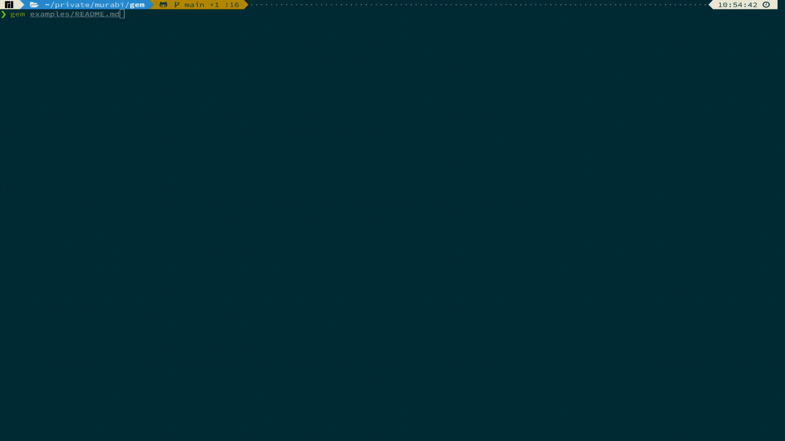

<p align="center">
    
</p>

# markdown-gem, a.k.a _gem_ - markdown code chunks executor

Inspired by [R Markdown code chunks](https://bookdown.org/yihui/rmarkdown/r-code.html), but for any code.

Our goal is to make markdown documentation, examples, instructions, or anything related to the code in your MD files - provable, easily maintainable, and integrate it into your CI pipelines.



## Install

### From crates.io
You'll need to have the [Rust development environment](https://rustup.rs/) installed and up to date.

Once it's installed, use cargo to install lfs:
```shell {cmd=sh}
cargo install markdown-gem
```
### From source
You'll need to have the [Rust development environment](https://rustup.rs/) installed.

Fetch the [murabi-io/markdown-gem](https://github.com/murabi-io/markdown-gem) repository, move to the `markdown-gem` directory, then run
```shell {cmd=sh}
git clone git@github.com:murabi-io/markdown-gem.git
cd markdown-gem
cargo install --path .
```

## Why use markdown-gem

* ***automate*** and **_document_** at the same time
* ***maintain*** your documentation and make sure the examples are working
* ***improve*** your user experience

## Code chunks
A code chunk is a code that is part of your markdown and you want it executed, e.g.
~~~
```sh {sys=[linux], linux_distro=[debian]}
apt install ...
```
~~~
The code chunk above defines a shell script to install something using `apt`, and it'll run only on **Linux** systems of the **Debian** family.
The metadata of the code chunk is ignored by most renderers and users will only see the shell code containing the `apt...` part.

### Attributes and filters
The attributes of the code chunk give the executor information on how to run the code, and filters define when not to run it.

#### Available attributes
| Attribute      | Type               | Optional/Default | Description                                                               |
|----------------|--------------------|------------------|---------------------------------------------------------------------------|
| cmd            | string             | no*              | command name or path, e.g. `sh`, `node` and etc.                          |
| args           | array of arguments | yes              | command arguments                                                         |
| path           | string             | yes              | `PATH` env variable for the command                                       |
| as_file        | boolean            | yes/true         | determines if markdown-gem should execute the code chunk as a file, default `true` |
| stdout         | boolean            | yes/true         | determines if markdown-gem should display stdout of the code chunk, default `true` |
| allow_warnings | boolean            | yes/true         | determines if markdown-gem should allow warnings, default `true`                   |
| allow_errors** | boolean            | yes/false        | determines if markdown-gem should TODO: allow errors, default `true`               |
| with_sudo***   | boolean            | yes/false        | tells markdown-gem to run the code chunk in sudo                                   |
> - \* the implementation of the default commands by code chunk lang attribute will make this attribute optional
> - ** the functionality for `allow_errors` is not there yet
> - *** sudo support is not available yet, you can still execute `gem` under sudo, but keep in mind that all code chunks will inherit the sudo privileges

#### Available filters
| Filter       | Type             | Optional/Default   | Inclusive/Exclusive | Description                                                                                                                                                     |
|--------------|------------------|--------------------|---------------------|-----------------------------------------------------------------------------------------------------------------------------------------------------------------|
| sys          | array of strings | yes/[]             | inclusive           | os system filter, possible values: `linux`, `macos`, `ios`, `freebsd`, `dragonfly`, `netbsd`, `openbsd`, `solaris`, `android`, `windows`                        |
| arch         | array of strings | yes/[]             | inclusive           | system architecture filter, possible values: `x86`, `x86_64`, `arm`, `aarch64`, `m68k`, `mips`, `mips64`, `powerpc`, `powerpc64`, `riscv64`, `s390x`, `sparc64` |
| linux_distro | array of strings | yes/[]             | inclusive           | linux distro filter, e.g. `arch`, `debian` and etc, derived from linux release ID_LIKE                                                                          |

## Security
The code chunks are executed on the host machine without any pre-checks in a form provided in the markdown documents. The execution is done through `tokio::process::Command` and the detailed documentation can be found here: [tokio::process::Command](https://docs.rs/tokio/latest/tokio/process/struct.Command.html).
> You should perceive running code chunks as running any other shell script, with all the inherent dangers.

## License and Acknowledgements
The implementation is based on [termimad](https://github.com/Canop/termimad) and few other projects. I would like to thank [Denys Séguret](https://github.com/Canop) and [crossterm-rs](https://github.com/crossterm-rs) for their work and the existing open source code I used as inspiration.  